# Asymmetric Copula

Repo used for reproducing and extending the paper: 
[Asymmetric copula in multivariate flood frequency analysis](https://doi.org/10.1016/j.advwatres.2005.09.005)

## TODOs
- VineCopula also fits rotated and survival copulas. What is that?
- put functions from load data into functions
- Summary on tail dependence 
- Relevancy of asymmetry in my copula (i.e. non-symmetric BIVARAITE copula)? 
- Simulate data according to Li's paper on copula
- Try to recover DGP modelling KENDALLS TAU! \
Do not model parameters themselves bc then things might get weird:\
Effect of parameters on the dependence structure depends on the generator function, but Kendall's tau is constant for all the copula types! Considering this, non-parametric estimation of thetas via Kendall's tau sounds pretty interesting... Zhangp.150. That is: 
I model Kendalls tau, then I select the most appropriate Copula from which I derive the "link" function i.e. parameter as function of kendall's tau. Then, I can interpret model on kendall level and translate that even onto parameter level (probably limited tho). It still might be interesting to compare the parametric (ML) estimates of the parameter with Kendall's tau estimate. That is, compare the fit suggested by both.
Note: I think parametric modelling of the parameter and then fit a model to it might get weird (again) due to different generator function i.e. parameters imply different dependence strucutre. Thus, modelling Kendall's tau is valid for any copula, while modelling theta depends on exact copula.
> Introduce connection parameter and tau in Paper. 
> If I want to compare non-parametric and parametric fit, maybe use p153 Zhang? Here, the comparison of fits is used to identify a best fitting copula
(Estimation p99)
- Tail dependency:
Tail dependence dependson on the type of copula and its parameter, i.e.: 
> Gaussian copula: No Taildependence (LTD = UTD = 0)
> Clayton: strong LTD (i.e. > 0) 
> Gumbel: strong UTD (i.e. > 0)
> Frank: LTD = UTD = 0
In practice: Captures co-occurence of extreme event --> HIGHLY relevant! If two rivers exhibit strong upper-tail dependence, extreme floos are more likely to occure together (and vice versa for droughts)
For modelling: Choose appropriate copula and estimate parameter. Tail dependence is implicitly given (is function of this parameter)
USING FITTED COPULA: Simulate extreme event scenarios to assess worst-case scenario! (Sounds very interesting)
- !!! Archimedean copulas cannot model negative dependence strucutre (really? Kinda read this on a thread only) This is due to the generator function being completely monotone --> Positive dependence only; What makes it more clear: Archimedean copulas are radially symmetric, that is, only positive correlation. BUT work around is modelling u' = 1-u instead of u itself I think? Then u' is enforced to have positive dependence while this implies negative dependence for u. That means the Kendall's tau I model MUST NOT be negative! (Should I use Beta distribution then? Would ensure meaningful values for tau) ALSO, to ensure to condition of thetas having this required order, I can model nested Copula: tau, outer level: tau_outer - tau_inner ~ beta (Not sure if Beta is reasonable bc sum of two beta). 
- Having simulated and fitted all the copula stuff, I would like to use the copula on a more hydrology based level and less on a statistic level
(Grimaldi had some neat mentionings. Revisit)

## Approach
### Given Data
#### For each station
1.1) Kendall's tau\
1.2) Fit copula\
1.3) Goodness-of-fit, etc\
1.4?) Anything else interesting here? Can I use fitted copula for something? 
Check paper for what they did here
#### Between stations
2.1) Model tau~. (Bayes?)\
2.2) How does tau bzw. betas influence the stations level behavior? What else to conclude?\
Hydrology point of view: Interesting in how e.g. slope affects extreme events. How could I visualize this? Maybe:\
tail dependence as function of parameter = as function of kendall's tau = as function of lin. pred --> plot as function of lin. pred\
--> "Sensitivity analysis"?
### Simulation
1) Model Kendall's tau using 

## Qs
- Due to the nested nature in NACs, can I consider each copula independently? i.e.: 
For trivariate, I consider the most inner copula independent in the sense of goodness of fit / modelling kendall's tau based on other coviariates. For the outer copula, all I need to consider is the condition on the dependence parameter thea. Thus, given the inner fit, can I consider goodness of fit between 3rd variable and inner copula (i.e. joint distribution / inner copula) independent of the inner fit? 
To the point: Is it valid to fit, consider goodness of fit and modelling from inside out? The next higher level then uses the inner fit and thus is kind of this "conditioned on a given inner fit" 
I mean, the R package _HAC_ estimates its parameters like this, but I cannot find a source stating this explicitly
- Want to model 
1) inner kendall's tau using GLM with beta response bc non-negative and between 0 and 1
2) outer kendall's tau by using inner - outer >= 0 to ensure the condition that inner must be larger than outer. Can I again use a beta distribution here? I mean, both Kendall's tau are dependent / correlated for sure. Is sum of correlated beta distributed RV still beta bzw. still reasonable to apply beta?
-> What are even the parameters estimated of the beta? I mean, I can easily model skewness using beta. Location and scale both for difference? No idea... !! Check paper, what do they use??

### References
- Bayesian Copula idea: Li - Improving forecasting performance using covariate-dependent copula models
- BRO HAS A WEBSITE:
https://tu-dresden.de/bu/verkehr/ivw/osv/die-professur/inhaber-in

### Notes during Data wrangling
- Discharge highly depends on what river and where at a given river we look at (i.e. at which station for a given river). 
Thus, the discharge threshold at which a flood event occures should vary. 
The flood event dependence structure / the copula is independent of exact values however.\
Idea: Use p-quantile of yearly discharge to identify when the flood event begins. Of all flood events, we choose the one with the highest peak discharge. 
Thereby we can\
a) Can compare dependence strucutre between rivers of different size since the dependence structure is scale independent\
b) We could also filter by p-quantile values (e.g. p-quantile > 100 discharge --> only look at large rivers)\
c) Let p in p-quantile vary to move the threshold i.e. see how dependence strucutre changes for varying threshold (like paper did)\
Visualization of different discharge behaviors: For each station, determine mean / quantile / peak of a year. Plot boxplot of distribution over the years for each station to compare distribution between stations / rivers / river spots.\
Issue: quantile flood indicator is sometimes quite off. Maybe it is more reasonable to use the slope as indicator? Like "at steepest point, flood event beginns" -> Value is threshold -> flood ends when threshold reached again. Potential issue I see here is when the steepest slope is at a very low threshold. Maybe I can use: Steepest slope as indicator when flood begins, but then I use mean / quantile as threshold for duration of flood event?
NEVERMIND: Choosing steepest slope and then another statistic to determine the threshold is meaningless. wtf. The peak of discharge is used to identify flood. That is, using the steepest slope and then still using another statistic is the same as just using another statistic.\
i.e. improve quantile approach by using a SMALLER quantile!\
--> Adjusting quantiles works fine! 
FOR LATER: Moving threshold (as paper does) could floods to be not well identified. Thus, changing dependence structure here might not be too meaningful since the flood event is not meaningful identified. Too large p (p = 0.95):
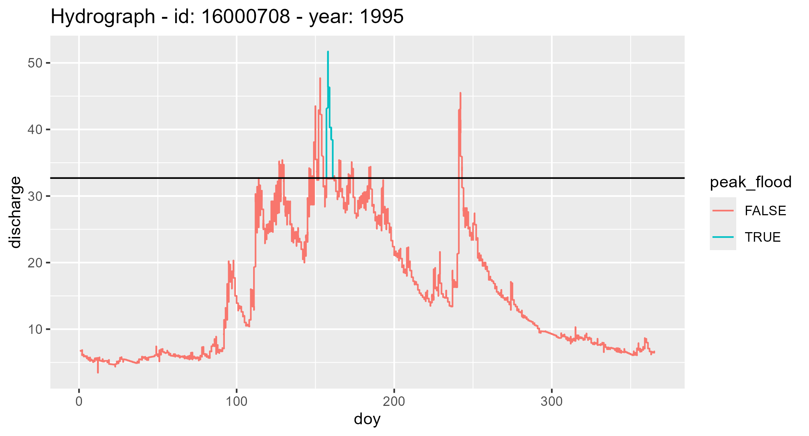
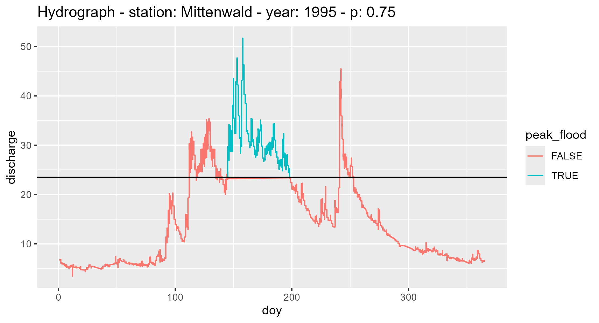
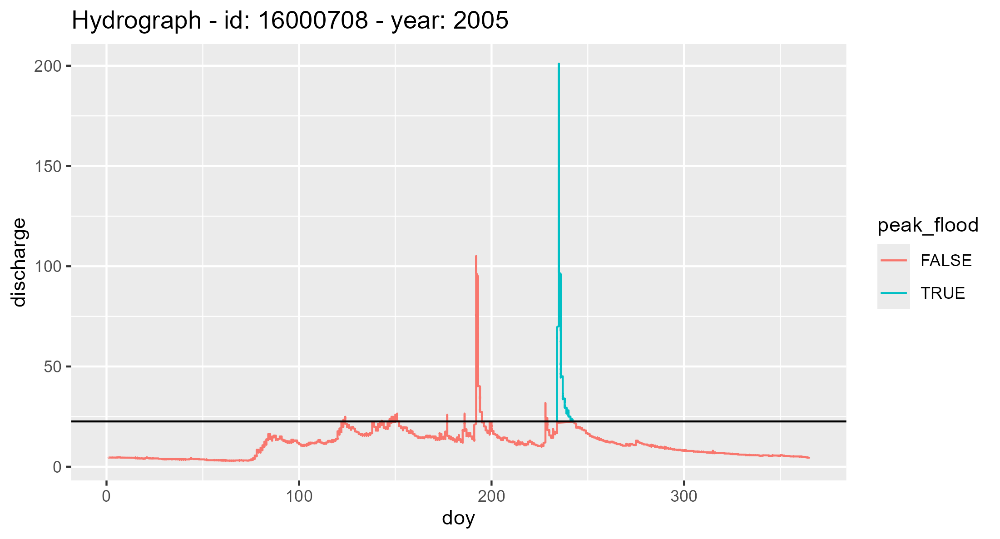
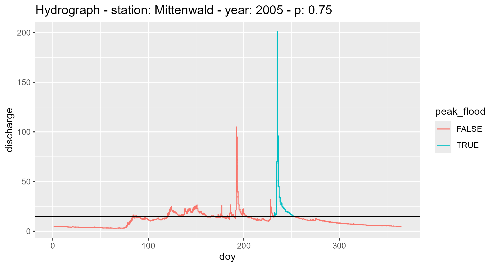
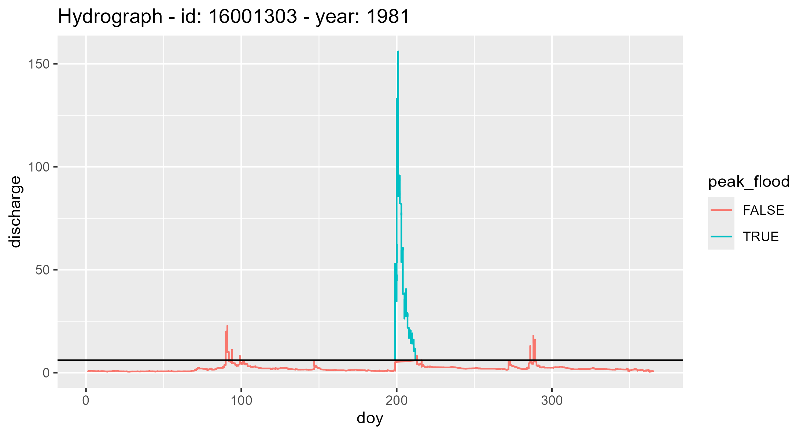
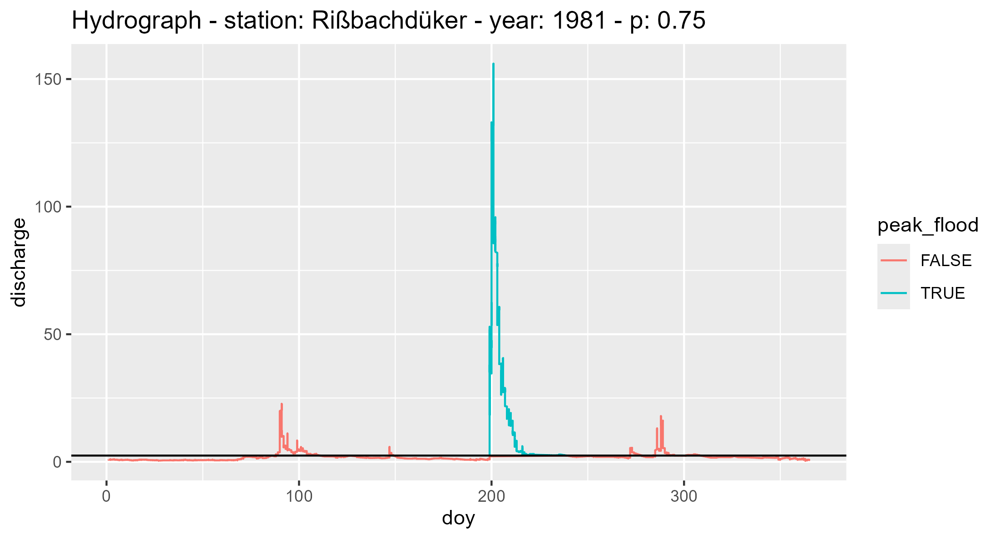
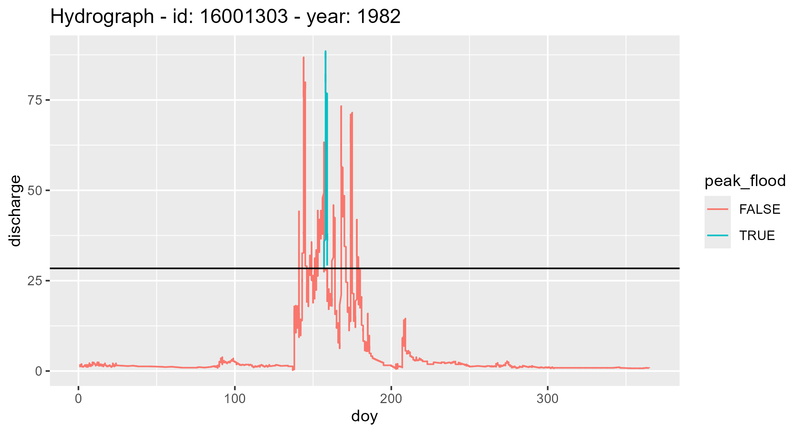
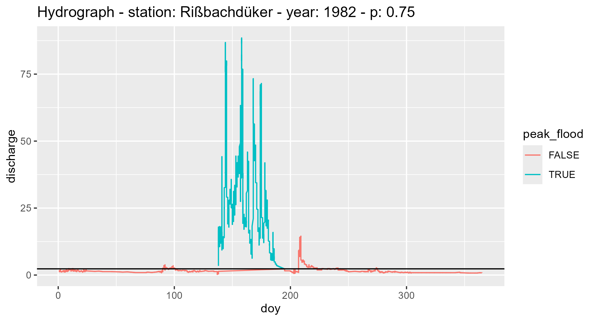

- Not all years contain meaningful data. The copula data set should be fine even with some missing years in between...\
Mostly the first year of the data is iffy. (For now) I drop the first year which usually contains only little observations (e.g. Moosburg in 2015 only 1 observation, Freising ~3000 observations (one every 15minutes) within 1 year..)\
There are also cases where years contain no data at all or very little:
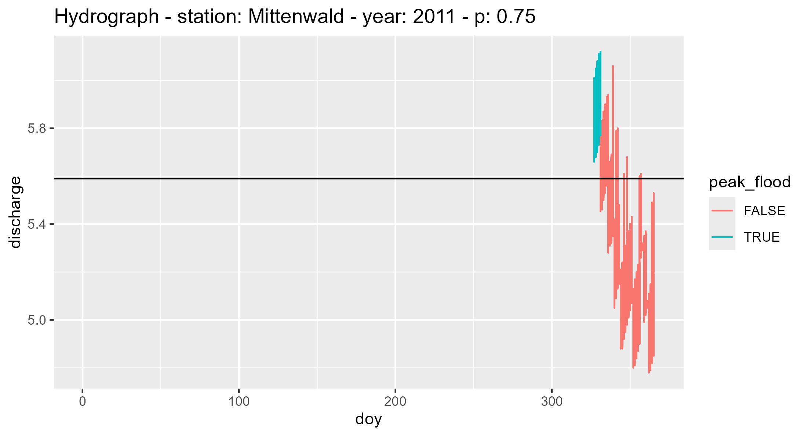
This is garbage and could lead to outliers in further analysis causing headaches.. Don't need those.\
Here is the completeness distribution for Donau and Isar. 
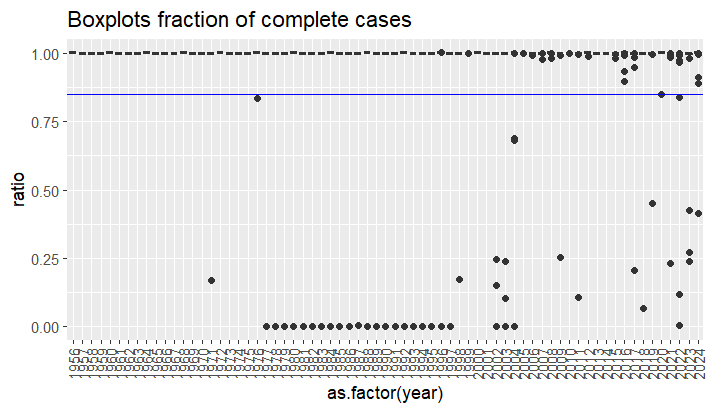
For these two the majority of years are complete (we have 30 stations / observations for each year). Thus, for years to be included in our analysis, they are required to be $90% $ complete.\
Note: Ratio larger than 1 due to leap year bc I calculated ratio by non leap year days\
I arbitrarily conclude that $85% $ is good threshold (blue line)

### Notes during single analysis (Station: Munich, River: Isar)
#### Grimaldi Paper
- Practical applications mentioned (p.1160):\
trivariate info required for design of expansion basin / diversion channel.\
building synthetic design hydrographs -> HOW?\
conditional joint density / distribution of volume and duration given peak
- Varying thresholds (p. 1162); They use FIXED thresholds tho. And given table2, their rivers do not seem too compareable tbh...\
I could try both: quantile and fixed, but I think quantile is more meaningful bc dependence structure is scale invariant anyway so relative consideration of flood event seems appropriate! 

Following is based on _fixed_ threshold. Paper does not mention how they decided on this fixed value (p. 1163, section 5.2 mentions this fixed threshold tho)

- Estimate Kendall's tau and test for significance (test not really necessary IMO)
- Identifying univariate distribution; ONLY if I use some parametric approach. Else I just use empirical copula. IF I use parametric approach too, I should check behavior of missspecification in simulation
- Estimate parameter for all considered copulas / generators: inner and outer generator as well as assumptions of symmetric trivariate AC\
(Using Canonical ML; This is also implemented in HAC; TODO: Read up on what that is and if its equivalent to iterative nested ML)\
For each estimate, also give the 95% likelihood profile CI (What is that?)
- From all fitted copulas, select best fitted\
Selection via: 
Visual comparison\
superimpose 5000 pairs of generated samples\
Hypothesis test\
(proposed by Chen in source 3)
- Comparison copula performance vs traditional model in flood analysis (WONT DO THIS), BUT the comparison is interesting: \
Compare two models via conditioning on values of Peak and plotting MOST PROBABLE pairs of volume and duration, i.e. mode of conditional cdf 

Considered Copulas: M3, M4, M6, M12

#### Ideas
- Initial plan: Model tau in dependence of other variable; Now: Estimates based on tau do not seem to perform that well in copula estimation process? 
##### Estimation
- Kendall's tau
- Use functions form to estimate parameters based on tau --> Don't bc estimates seem to be not as good..
- Copula selection (see also goodness-of-fit)
(- Kendall's tau as response --> estimate coefficients of linear predictor; POSTPONED until I am done with main copula modellling)
- CANNOT use any available package to estimate with mixed generator functions. Would have to implement this myself. Cannot just estimate nestedly bc then joint variable is considered as a fixed variable which biases the estimates...
What I would need is to determine the likelihood for all the different generator functions (I think) and then just run constraint opimizer to ensure the conditions on the parameters
FOR NOW, use SAME copula families I guess.... IF I HAVE TIME, I can implement constraint optimization on the copula likelihood... Check the paper Okhrin - on the structure and estimation AND Hofert - Densities of nested Archimedean copulas

Note: I cannot estimate recursively, but I can apply GOF recursively bc then I use the unbiased estimates anyway..

##### Goodness of fit
- Comparison observed and generated
- Cramer-von Mises statistic
- Rosenblatt transform
- Anderson-Darling statistic
- Empircal comparison
- Simulated data from fitted vs actual data
- Check other paper
- Out of sample performance / validation?

##### !! TODO: Practical application
- Tail dependence
- ? "Synthetic design hydrographs" (What ever Grimaldi paper means by that)

# Vine copulas
- Naglers paper for my purpose is a banger. BUT they also model tau? That seems odd given that the other paper mentions bias due to Jensen's inequality. 
Can I run simulation modelling both and check if there is a bias or not?? Also, how does estimate behave if I change response function? 
The closer to linear, the less bias, right? For identity, we should not have bias but the model would then be wrong, no? Evaluate true MSE in simulation
For simulation I'd like to evaluate true MSE and some goodness of fit statistic and simultaneously check if that works 
sim: https://tvatter.github.io/gamCopula/
- TIME-VARYING MIXTURE COPULA MODELS WITH COPULA SELECTION; I think they allow both: Time varying weights on mixed copula structure AND estimation of copula params as function of covariates. Not too sure tho. Doesn't seem too hard either(?) BUT I think I would have to implement everything myself. So postpone this for now. 
- I have coordinates of stations; I could use L2 norm to determine distance and use as input for time. Issue is that number of estimates increases 
Maybe not advisable bc only 50 observations each (50 years with 1 flood event each)

- Trees are visual representation of the complex product 

!! For now, focus on vine copulas as alternative to NACs bc the issue at hand is the violated assumption of NACs. Regression task is more relevant later....
TODO: Write functions during simulation s.t. they are widely applicable to my data.
I can even compare tau-modelled NACs with tau modelled Vines

- Estimation of vine copulas (As in VineCopula package)
RVineCopSelect: Fit Bivariate copulas to each bivariate dependence structure. Parameters are estimated using MLE. It takes in UNIFORM distributed
variables. Selection of fitted models via AIC.
Function takes matrix of [0, 1]^d. That is, it is independent of the transformation (pobs or parametrically)

- Estimation of GAM vine copulas: TODO - see gamCopula
gamVineCopSelect

- The vine structure can follow from theory. In practice, we are especially interested in a conditional copula of two variables.
Since vine implicitly come with a conditional copula, it's perfect! 
But does "wrong" tree affect the validity of my estimate? e.g. enforcing volume and peak to be the conditional copula, does the KL change?
Based on the derivation of the vine copula density, I would say it does not matter. Because there is not rule dictating which of the 
  pairs must be conditonal for the math to work out. Espeically in the trivariate case where we only have one conditional copula.
TAKEAWAY: Model that one conditional that I am interested in anyway

# Application
Following is based on Isar station Munich if not mentioned otherwise. Also regarding the models and the number of observations in each station. Here is the distribution of number of observations (i.e. observed years per station) for the river Isar and Donau:\
Table:\
`5 15  20  27  >30`(nobs)\
`2  1   2   1   23` (nstations with these nobs)

Estimating (only) the dependence strucutre / copula, for stations with moderate number of observations.\
To estimate copula _AND_ GLM, I can only use stations with MANY observations
Thus:\
1) Estimate copula and create the Bavaria plot based on these estimates. Remove those stations with 5 obs or smth\
2) Fit GLM(M) for the stations with many obs and interpret beta, no further bavaria plot here

## Considerations
(Also in terms of simulation as the the simulation interests are derived from the application)

Concluding from the data, the assumption of NACs is violated. Thus, I need to fit not only NACs, but also Vines which are able to capture the data underlying dependence strucutre. 

Regarding the estimation of NACs, I need to use `HAC`-package because sequentially estimating a bivariate copula does not accounts 
for the fact that the nested strucutre is a function in two random variable. This leads to a bias (Okhrin - On the strucutre and estimation of hierarchical Arch. copulas).
But, sequential GOF are valid if the estimation process is based on `HAC` bzw. based on non-biased estimation process.\
The `HAC` package uses (canonical) ML estimation for $\hat{\theta}$ because estimates of $\theta$ based on Kendall's $\tau$ has several disadvatages:
It does not guarantee that the sufficient nesting condition is fulfilled (Hofert - Densities of NACs uses this wording). Also the estimate of 
the copula parameter is biased because the relationship between $\tau$ and $\theta$ is highly non-linear (Jensen's inequality).\
Aparently, the `HAC`-package is somewhat limited to same family copulas for all nested copulas. IF TIME, I CAN TRY TO IMPLEMENT SOMETHING, 
but the NACs are not even of the right dependence strucutre anyway... so probably not.\
Regarding the estimation process, Li - "Improving forecasting performance ..." suggests modelling $\tau$ in terms of a linear predictor. 
I wonder why they model $\tau$ since the copula paramter is then supposed to be biased.\

Intersting for simulation: Compare bias in the modelled paramter (HAC: copula parameter) and the function of it (HAC: tau is function of estimate).
i.e. For `HAC`, I want to evaluate $\theta - \hat{\theta}$ and $\tau - \tau(\hat{\theta})$ and see if one is biased while the other is not or if they 
behave similar. 

For NACs, I would first fit the copula using `HAC` and then model the dependence parameter using GLM. Maybe inner $\theta \sim Ga(.)$ and 
for outer $\theta$ I model the difference between outer and inner? 

Intersting for simulation: Does this approach even work? I mean, I do not find a paper particulary suggesting that this approach is valid. 
It is more based on what I read in Li - "Improving forecasting performance...."

Regarding Vine copulas, things are more chill since the package `gamCopula` has already all I need (I think). Here, all I do is based on 
Vatter, Nagler - "GAM for PCC". The function simultaneously fits the copula and the GAM.\
I think for purpose of comparison, I first should fit the GAM using only an intercept which (should be) is equivalent to estimating copula
without any GAM approach.\
Interesting is that the `gamCopula` package models the $\tau$ coefficient using the Fisher z-transformation as link. 

Intersting for simulation, again, is the comparison in the bias. (see above in NAC section)

(Vatter 1st paper[GAM for Conditional dependence...]:) gamCopula package / Vine approach models tau, bc tau more natural interpretation than copula param AND somthing else :D  

What are the theoretical properties of estimates for tau, theta and beta? Think the 1st paper by Vatter goes into that? 

## Fitting copula
i.e. no GAM used anywhere for now

### NACs / Copulas in Paper
M-type copulas refer to specific types of NACs i.e. they extend bivariate Archimedean copulas.\
Copulas unsed in paper:
| Copula |Base Type| Tail dependence| Use cases |
| -------- | ------- | ---- | ---- |
| M3 | Frank| No tail dep.| Symmetric / weak dependence |
| M4 | Clayton| Lower tail dep.|Strong lower tail dep.|
| M5 | Joe| Upper tail dep.| Strong right-tail (???) dep.|
| M6 | Gumbel| Upper tail dep.| Upper tail dep.|
| M12| Mixed|Mixed tail dep.| Hyprid tail dep. (???)|

Also simulation:\
Actually, I think I would also confirm what the paper found: Assumption of symmetric Archimedean copulas is bad. But only as a side note.
Like "yes, we can confirm the paper findings, but the paper still is wasted bc even NACs assumption is too restrictive. So Vines should be used!"
Maybe also in simulation (dont have to show others): Performance comparison between the types of estimating HAC (see HAC p.6 iii))

See:\
HAC 

#### R 
Using `HAC` and copula package .
See:\
HAC 

Okhrin - "properties of HAC": Why HAC only implements same family copulas: However, if we consider generators from
different families within a single copula, the condition of complete monotonicity is not
always fulfilled and each particular case should be analysed separately

### Vines

Implemented copula families are limited: https://cran.r-project.org/web/packages/gamCopula/readme/README.html
(Gaussian, t, Clayton, Gumbel, Frank).

Vine structure matrix: Encodes which pairs of variables appear in each level of the vine construction.
Vine idea: Nested sequence of trees, each trees edges becomes the "nodes" of the next tree. For d-dimensions, we have d-1 trees. Each edge in a tree corresponds to a bivariate copula
Matrix: Encodes which variables are considered bivariate and which considered conditional on other variables (and on which)
Matrix construction: First row (or column, depending on convention) 
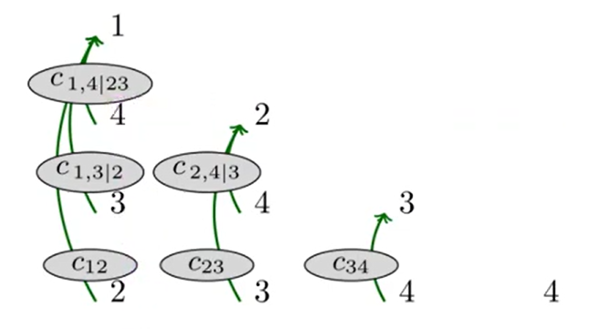
or watch: https://www.youtube.com/watch?v=NY9-oWZqAUg

#### R

## Fitting GLM(M) for tau / copula param

- 

# Simulation
Open Qs: 
- What selection method is used between the packages? This implies some GOF measure and will influence the results of course
  Is there something better suited for small samples i.e. 50 obs for copula and 15 obs for GAM
- Evaluate the bias implied if sequential ACs are used for NAC estimation?
- Issue I see when only including slope is confounder of course. And I cannot even controle for variable or fit a spline bc 
    we have so few observations.. 
    Keep parts of it descriptive and fit model, but take result "with grain of salt"? 
    But also, will see how it performs in simulation, right? 
    -> 
- Compare all 3 copula fits and confirm what paper showed: AC for NACs are bad (and their tau estimate have this bias thingy mentioned in the paper)
  ALSO compare NACs with Vines if NACs violated and see how it behaves
- Evaluate small sample performance for each estimate

## Copy pasta from old sim
General thought: 
Can I not just look at the nested copulas individually (like the likelihood does?)
i.e. 1st look at the fitted copula between more correlated
     2nd look at the fitted copula between copula values for inner 2 and pseudo obs of 3rd variable
Is this valid? 
-> How do other paper approach? 
-> How are the gof metrics defined?  
ALSO if I do this, I can use this damn copula shit package!
General thoughts on validity: 
Hierarchical strucutre implies that we model relationship inner independent of the outer one
-> partial exchangeability
But for sure it is valid to assess wheather a sub-copula is valid. And if that is the case
it should be valid approach generally. lol. reasoning. 

compare CDF's between empirical copula and copula based on parametrical assumptions
They shood look somewhat similar I guess
(HAC doku Abbildung 6)

Comparing the empirical PIT or empirical copula to theoretical counterparts helps assess the goodness 
of fit of multivariate models.
Actually, visual and then comparing by likelihood should work, right? 

For Sim: NAC, AC - I only care about vine AIC (selection criterion --> Is correct copula structure selected?) and kl (how is performance given missspecification)
        Vine - NAC, AC only AIC and KL again. 
  Stop wondering how to include the estimates for the corresponding simulation. I do not need that

# Presentation
- Fow now, finish up the Vine part. Let's see if I can finish the GAM copula part before the presentation. Else, I put that into the paper only
- State the problem we observed with our practical data and introduce vines briefly
- Point out the differences between ac, nac and vine. Important part is showing the density plots (see next point)
- Have density plot of each considered copula so people get a feeling for what implies what
  Actually, discuss more detailled what each of the copulas imply
  Also mention which parameter conclude to independent copula for each copula family
- Data presentation, then sim: Used empirical taus in simulation
- Introduce both copula types, a bit more thoroughly such that the difference becomes clear i.e. the limitation in NACs
Introduce Vines using the graph AND the formula bc without I think its super confusion. Missed the formula...
- Lovely sidenote during the presentation:
NAC or HAC packages are a total desaster. Really. They break super fast, they are not congruent, the common copula package only allows to 
estimate multivariate AC, but the package claims to be able to estimte it all, however, there is HAC which seems to be an alternative, but 
if HAC comes to the conclusion it is a symmetric AC, it breaks down. None of these packages make sense. I swear. Just use Vines. Really.
- Could include screenshot of Email from GKD where they tell me they send me an email when I can download data. Reason why I only use the large rivers. I think thats funny :D
"Still waiting on that mail... So we manually downloaded station data from GKD website, during which is was still being a pain, focusing on largest river so our data is elagible for both our analysis parts."
- Goals: 
  Verify paper findings (Like graphically showing tau behavior for AC estimate given NAC),
  Initial goal: Effect of slope onto dependence strcuture
  Data: NAC not really suitable, no? 
  Solution: Introduce vines
- What is motivation / relevance (Hannes)
- Data collection / Data presentation 
- - GKD provides 
- What are the methods we used (Robin)
- Analysis
- Discussion
- Conclusion

# Copula packages
DUUUUUUUUUUUUUUDE!! 
How is every copula package different in some aspect. I cannot implement all this myself and rely on this bs and the damn copula package does not even have a AIC method?? And the logLik funtion does not work for trivariate copulas??? What is this? Like, NACs are just shit or what?

# What to do with fitted copulas
- What to do with fitted copula? Synthetic data is giga strong! 
Synthetic data is basically increasing the number of years we observed flood events. That is, now we only observed 50 events, but we can just
draw 5k observations from our fitted copula. 
This data can be used in hydrological simulations or also as GoF test.

Show copula and marginal Scatterplot for all stations
(Can do that for all stations still. Then, go from all to just Muncih station)

Focusing on Munich station: 
- Explain Copula densities and tail dependence i.e. interpret the tail dependence and mention what copulas imply a tail dependence and which do not

- Just for munich, consider observed margins vs. margins with sythetic data. Do they match? 
This is half way to estimation of the (univariate) margins. What we can also consider is the empirical JOINT pdf bzw CDF (use empirical bc no real assumptions but still easy to interpret and fulfills purpose now)

- Using the empirical joint CDF: Use combination of peak, vol, dur: How likely is this combination
1) Draw threshold into cdf s.t. probability is around 1. Since 1 combination represents the most severe flood event of one year, the 1% combination corresponds to the Jahrhundertflut values! Damn :D 
2) Also, Check the values for last years flood in Munich. I was actually stuck in my hometown back then. How likely is such a combination? Should I get a car or what :D 
NOTE: Using this approach we kind of imply that the data is representative through the years. This is of course not really the case bc eg climate change. Would need a more comlex model. But I can evaluate the above using this simple model.
(Go here from copula densities -> Synthetic data -> inverse PIT -> empirical estimation of CDF <<<< What I need)

- Conditional scenario generation: Given one / two of the other variables, I could draw conclusions on 3rd bzw. on joint density. But this won't be applicable for me I guess.

- Tail dependence / measure of asymmetry: Not sure how to use this in our analysis? I mean, when we reduce to just one station, we could discuss the implied distribution in more detail? Also talking about tail dependence. 

- Synthetic data: Basically increasing the number of years I observed. Can draw from fitted cop, retransform using empirical 
inverse PIT and see how it looks. Maybe look at marginals?

# Final Presentation

## Grading 
- 30min presentation
- 15min discussion (own)
- 15min discussion (leading other presentation)
- Submission of slides 24h before lecture (15.3.)

## Structure
(Structure as in a paper)

Intro and Problem: Relevancy (Hannes + Intro of Paper)
Data (Data first so in Methods we can discuss limitations and draw conclusions for methods)
Methods
Simulation (performance evaluation)
Analysis (applied)
  - What to do with fitted
Summary 
  - What now
Appendix
  - Additionals

! Keep it intuitive. Keep it low in math and explain hydrology

### Intro / Problem / Relevance 
- Hannes and partially intro of paper 
- Explain discharge in terms of what that is (i.e. water volume per s)

### Data
As we will see from the data, the methods used in the paper have their limitations that are not fully applicable to our data.\
Critique on paper here: Methods used in paper are potentially not suitable for their data either. However, not sure because they never discussed the dependence structure of the observed data in detail. 

- What we are interested in: Peak, Duration and Vol of the most severe flood event in a year for multiple years

- How do we get this data: GKD offers data to build a hydrograph over multiple measurement stations = measurement points
1) What is a measurement station: Geographical location where water discharge values are measured. 
PLOT: Bavaria map with all stations we consider
  -> Stations are at rivers
  -> We look at THESE rivers 
  -> How do we get from a station to hydrograph?
  -> Select Munich station and proceed

2) What is a hydrograph: 
Discharge of water over time, here: discharge of water since year xy up to 31.12.24
PLOT: Example hydrograph munich 2024

3) How to derive our data from this:
  - Focus on one year only
  - Apply straight line method to identify flood
  (brief explanation using a PLOT: threshold line in hydrograph)
  - Given identified flood, graphically show variables

  APPENDIX: Not all years were as nice. Save plot in appendix by which I decided to use a year or not

4) Repeat this for every station and every available year. 
  Focus on Isar only
  PLOT: Show scatterplot for all stations with margins

- Describe the data. 
1) How many obs per station (What is average count years / nobs)
  - Mention that sample size is not too great
2) How many stations at Isar
3) Marginal distribution for each station (same format as before)
Especially intersting since we used QUANTILE instead of a fix threshold. That is, the margins probably have totally different scale. 
  Reason: A small river is flooded at a different discharge than a large river, of course
  This is fine: 
  a: First part only focuses on within station dependence
  b: Copulas are independent of margins anyway. That is, the dependence structure is totally independent of any scale
- Mean of peak, vol, dur
- Plots:  
  PLOT: Data marginals on SAME x axis to show the difference in scale
  PLOT: Data with own x-axis to discuss the different shapes
    -> Mention: We do not need to worry too much about different shapes due to copula
5) Tau values for the whole Isar 
  ! Point out that 3 different taus bc relevant for Methods

10) Slope values at station

### Methods
(low in math [show baic formula so, but then intuition / graphs], focus on plots. i.e. density plots for the copula showing their limitation in modelling dependence structures)

- Brief refresher on PIT
  -> Mention that there is empirical Copula, which is non-parametric / empirical PIT
  We use this because avoids any estimation process which is nice in context of our amount of observations

- Strength of dependence in terms of tau:
  - Explain: tau is a correlation coefficient (We all know what this is)
  - For increasing tau, variables are more dependent. 
  That means, the TYPE of dependence is indepedent of the STRENGTH of dependence. 
  Very important for the following 
  PLOT: Same dependence type with varying dependence strength

- Considered dependence types:
  Plot of each discussing their characteristics (tail dep esp.)
  - Frank
  - Gumbel
  - Clayton
  (all AC family)
  Explain: These dependence types already are copulas, but bivariate. We want trivariate, thus introduce trivariate AC, NAC and Vines
  PLOT: Scatterplot for many many obs or density. Maybe overlay?

- Brief introduction to relevant copulas trivariate case
  - AC: 
  math formula 
  Limitation: Just 1 copula, i.e. variables must have same dependence structure and strength
  - NAC
  math formula
  Limitation: 2(d-1) different copulas, i.e. (as above, but for 2)
  Mention: This is the one examined in the paper
  - Vines
  math formula
  Below: Tree representation (or Appendix)
  Limitation: No limitation on the copula. 3 different allowed. Totally flexible
  Mention: Seen from data we know, that tau takes on 3 different values, implying that NACs are not reasonable as they enforce the same copula for two relationships

- Selection between copulas using AIC

### Simulation
Paper compared AC and NACs and showed NACs are way better if dependence DGP is asymmetric. 
Since our data suggests that NACs are too restrictive, we care about how NACs perform given Vines are true, but also, how do vines performe if we falsely fit a vine

Paper:
  - Showed that AC underestimate 
TODO: Plot vine taus and plot estimated NAC taus. Any dependence? 

- Metadata of simulation

- Missspecification: 
  - KLD
  - Behavior of vines fitted if NAC true 
    -> Conclusion: Always fitting vines ok

- OTHERS

- Goals: Copy Paper goal - kind of, but improved
          Estimate Slope effect on dependence structure

### Application
- Fit all vines and check AIC ratio to show vines are more reasonable which we expect by tau values

- Plot fitted densities and synthetic data

- What to do with it?

- Put Sklar in the Appendix

